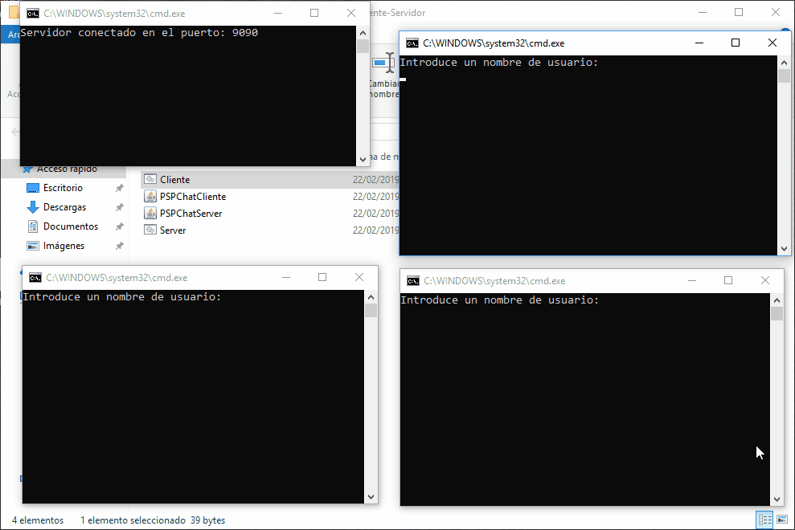

## Chat Cliente-Servidor Multihilo
Para hacer esta aplicación he construido 4 clases en un mismo proyecto y al acabar lo he exportado a 2 jars executables diferentes, donde en uno se ejecuta el servidor, y en el otro solamente el cliente. Conforme a lo que se pedía, he construido un servidor multihilo que acepta conexiones de clientes que a su vez van en su hilo correspondiente. 

### Muestra en ejecución:



> Por comodidad, he hecho un simple .bat para el servidor y el cliente para no tener que abrir la consola manualmente cada vez que queramos usarlos.

```
@ECHO OFF
java -jar PSPChatServer.jar
```
```
@ECHO OFF
java -jar PSPChatCliente.jar
```

### Clases:
[ChatServer](ChatServer.java)
[ServerThread](ServerThread.java)
[Client](Client.java)
[ClientThread](ClientThread.java)
<br>

[Volver al índice](../README.md)
