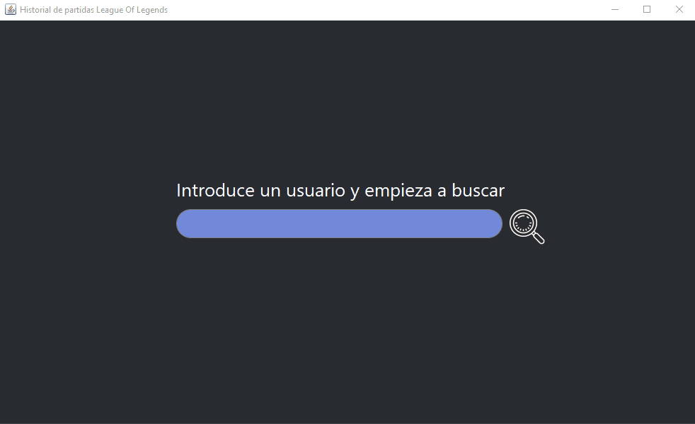

# Proyecto API League Of Legends
Esta aplicación se basa en extraer el historial de partidas de un jugador mediante la API que nos proporciona Riot y mostrarlo gráficamente en pantalla:



Como se puede observar, he optado por un diseño simple y elegante, he rediseñado el típico TextField con unos bordes ovalados para una barra de búsqueda más bonita y he sacado partido de la animación de componentes en tiempo real mediante hilos. La interfaz gráfica es la de Swing, y para construir las ventanas y los paneles he usado el plugin de [WindowBuilder](windowbuilder.png).

## Clase PanelPartida
[](https://gyazo.com/b1afb9d9c04a80bfe3c670f5d9222206)

Aquí es donde construyo el panel de la partida que mostrará prácticamente toda la información de manera visual (como el campeón jugado, la fecha, duración de la partida, asesinatos, muertes, asistencias, cs obtenidos, objetos comprados, campeones del equipo aliado y enemigo y sus usuarios, etc). Este panel es el que se reutiliza dinámicamente para construir una lista que será el historial (clase PanelHistorial).

## Clase ApiRequest
En esta clase hago uso de la librería riot-api para facilitar la conexión y la extracción de datos a través de los métodos que he creado **requestSummoner()**, **requestMatchList()** y **requestMatch()**. Para recuperar la información de todos los campeones en forma de lista uso **getAllChampions()**, donde recorro el json "champion.json" y paso los datos a un objeto de la clase Campeon.

> **Nota:** Para poder conectar con la API de Riot, me he tenido que registrar como desarrollador en su página y hacer uso de la key que se genera automáticamente. Esta [expira cada 24h](https://i.gyazo.com/8599d585b89e8e020cd609f3905f773d.png), y si se usa la aplicación con la key expirada mostrará un error Forbbiden. Por tanto iré actualizándola cada poco tiempo hasta la corrección (se encuentra en la clase ApiRequest).

```java
public class ApiRequest {

	private static final String API_KEY = "XXXXX-XXXXX-XXXXX-XXXXX"; // EXPIRA EN 24 H
	private static final ApiConfig config = new ApiConfig().setKey(API_KEY);
	private static final RiotApi api = new RiotApi(config);
  
  ...
```

> **Nota 2:** El resto de las explicaciones están comentadas en el propio código.


[Volver al índice](../README.md)
