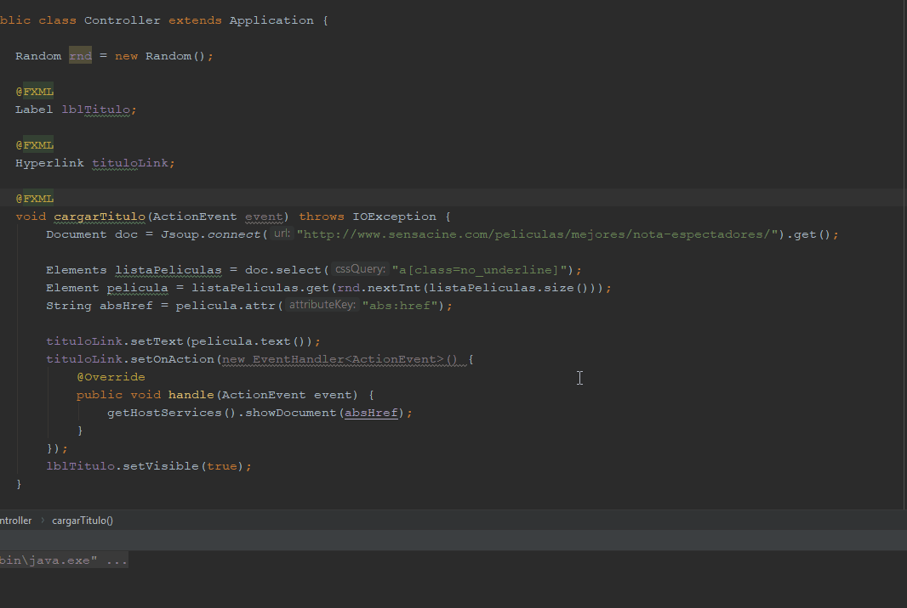

# Substracción de información web a través de JSoup
En esta actividad he decidido hacer un simple randomizador de películas de sensacine usando JavaFX y JSoup en el IDE de IntelliJ. Al pulsar sobre el botón de "¡Muéstrame una pélicula!" se visualizarán un Label y un HyperLink con una película aleatoria, a la cuál podemos clickear para verla en su página web.

### Muestra en ejecución:



### Muestra de código relevante:
```java
    @FXML
    void cargarTitulo(ActionEvent event) throws IOException {
        Document doc = Jsoup.connect("http://www.sensacine.com/peliculas/mejores/nota-espectadores/").get();

        Elements listaPeliculas = doc.select("a[class=no_underline]");
        Element pelicula = listaPeliculas.get(rnd.nextInt(listaPeliculas.size()));
        String absHref = pelicula.attr("abs:href");

        tituloLink.setText(pelicula.text());
        tituloLink.setOnAction(new EventHandler<ActionEvent>() {
            @Override
            public void handle(ActionEvent event) {
                getHostServices().showDocument(absHref);
            }
        });
        lblTitulo.setVisible(true);
    }
```
<br>

[Volver al índice](../README.md)
